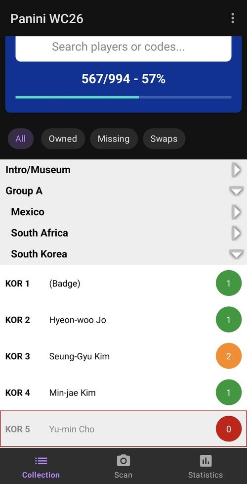
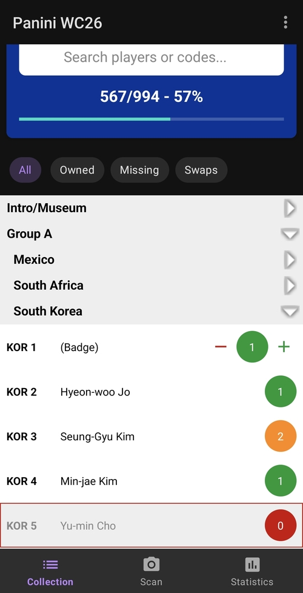
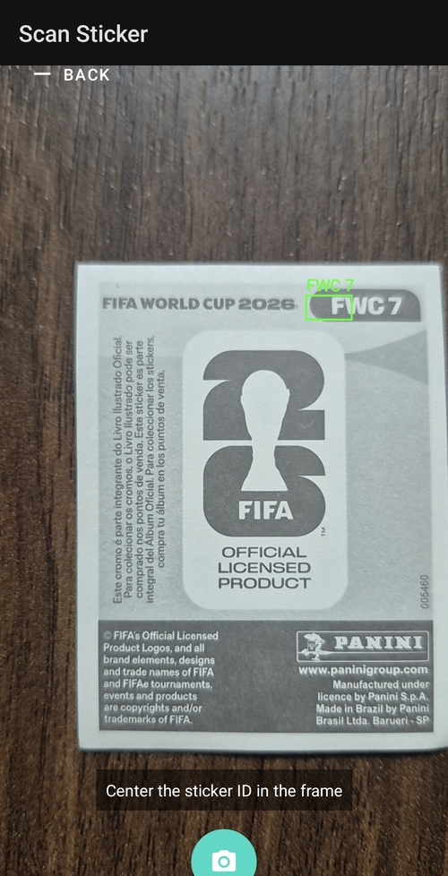
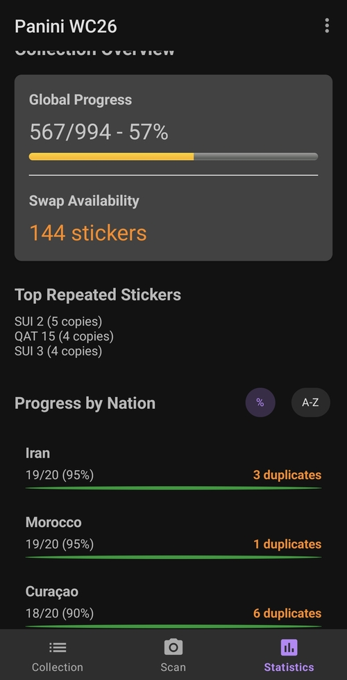
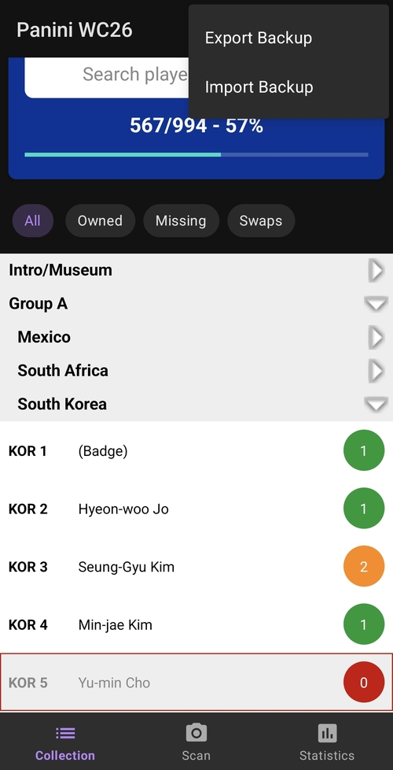

# Rastreador de Láminas Panini FIFA World Cup 2026 - Manual de Usuario
*(Edición Colombia - Distribuida por Continente)*

Bienvenido al manual de usuario oficial del Rastreador de Láminas Panini FIFA WC 2026. Esta aplicación está diseñada para ayudarte a gestionar tu colección de láminas (monas/stickers) de manera eficiente, seguir tu progreso hacia el álbum completo e identificar repetidas para intercambiar.

---

## 1. Introducción
El Rastreador de Láminas Panini FIFA WC 2026 es una aplicación nativa de Android adaptada para la edición colombiana del álbum. Cuenta con una base de datos completa de las 994 láminas, incluyendo la sección FWC (Museo), las 48 Selecciones Nacionales y las exclusivas de Coca-Cola.

### Características Principales:
*   **Catálogo Completo:** Pre-cargado con todos los nombres y códigos de las láminas.
*   **Navegación Inteligente:** Vista de acordeón anidado para una búsqueda fácil.
*   **CV Scanner:** Usa tu cámara para identificar y agregar láminas automáticamente.
*   **Estadísticas en Vivo:** Seguimiento en tiempo real del progreso y repetidas.
*   **Portabilidad de Datos:** Exportación e importación mediante archivos JSON.

---

## 2. El Rastreador Principal (Master Tracker)
El Rastreador Principal (**Master Tracker**) es tu interfaz principal para gestionar la colección.

### 2.1 Navegando por la Lista
La lista está organizada según la estructura oficial del álbum:
1.  **FWC (Intro y Museo):** Láminas 0-19.
2.  **Groups A - L:** Las 48 naciones participantes, cada una con 20 láminas.
3.  **Coca-Cola Exclusive:** Láminas CC 1-14.

**Agrupación por Acordeón:**
*   Toca el encabezado de un **Group** (ej. Group K) para ver los países dentro de él.
*   Toca el encabezado de un **Nation** (ej. Colombia) para expandir la lista de láminas de ese equipo.
*   La aplicación recuerda qué secciones dejaste expandidas para un acceso rápido.

### 2.2 Agregar y Quitar Láminas
Usamos un sistema de "Revelar al Tocar" para máxima eficiencia:
1.  Ubica la lámina en la lista.
2.  **Toca el Círculo** que muestra el número de copias (ej. "0").
3.  Aparecerán los botones de ajuste en la misma línea.
4.  Toca **(+)** para agregar una copia o **(-)** para quitarla.
5.  Los cambios se guardan instantáneamente.

### 2.3 Indicadores Visuales
*   **Missing (Borde Rojo):** Las láminas que aún no tienes aparecen atenuadas con un borde rojo y una etiqueta de **"Missing"**.
*   **Owned (Verde):** Una vez que tienes al menos una copia, la lámina resalta con una etiqueta de **"Owned"**.
*   **Duplicate (Naranja):** Si tienes 2 o más copias, el número se resalta en naranja vibrante para indicar que es un **"Duplicate"** disponible para cambio.

### 2.4 Búsqueda y Filtros
Usa la barra superior para encontrar láminas específicas:
*   **Search:** Escribe un nombre (ej. "James"), un código ("COL 10") o un país ("Brasil").
*   **Filtros de Estado (Chips):** Filtra la lista completa usando las opciones:
    *   **All:** La colección completa.
    *   **Owned:** Solo las láminas que ya tienes.
    *   **Missing:** Solo las láminas que aún necesitas.
    *   **Swaps:** Solo tus láminas repetidas para intercambiar.

---

## 3. Computer Vision (CV) Scanner
El CV Scanner te permite agregar láminas a tu colección simplemente apuntando tu cámara a la parte posterior de la lámina.

### 3.1 Cómo usar el Escáner
1.  Toca el icono de cámara en la barra de navegación.
2.  Posiciona la parte trasera de la lámina dentro del marco de la cámara.
3.  El escáner está optimizado para encontrar el **Sticker ID** que usualmente está en la esquina superior derecha.
4.  Aparecerá un cuadro verde una vez que se detecte un código válido (ej. "BRA 15").

### 3.2 Flujo de Confirmación
Para evitar adiciones accidentales, el escáner usa un proceso de dos pasos:
1.  **Detección:** La app identifica el código.
2.  **Confirmación:** Aparece un diálogo mostrando el nombre de la lámina y tu cantidad actual.
3.  Toca **"Add to collection"** para incrementar la cuenta, o **"Cancel"** para omitir.

*Nota: El escáner funciona 100% fuera de línea (offline). No requiere conexión a internet.*

---

## 4. Estadísticas y Progreso
Toca el icono de estadísticas (**Stats**) en la barra de navegación inferior para ver el estado de tu colección.

### 4.1 Progreso Global
*   **Barra de Progreso:** Mira tu porcentaje total y el conteo exacto (ej. 752/994).
*   **Swap Count:** Mira exactamente cuántas láminas tienes para cambiar.
*   **Top Repeated:** Mira cuáles son las láminas de las que tienes más copias.

### 4.2 Desglose por País
Desliza hacia abajo para ver una lista detallada de cada nación y sección:

*   **Progress:** Número de láminas obtenidas para ese equipo específico.
*   **Swaps:** Número de láminas repetidas para ese equipo.
*   **Ordenamiento:** Usa el selector para ordenar esta lista por nombre o por porcentaje de progreso.

---

## 5. Gestión de Datos (Backup & Restore)
Protege tu progreso creando copias de seguridad.

### 5.1 Exportación de Datos
1.  Abre el menú de opciones (tres puntos) en la esquina superior derecha.
2.  Selecciona **"Export Backup"**.
3.  Elige una ubicación en tu teléfono o en la nube (Google Drive, etc.) para guardar el archivo `.json`.

### 5.2 Importación de Datos
1.  Selecciona **"Import Backup"** en el menú de opciones.

2.  Selecciona tu archivo `.json` guardado previamente.
3.  **Warning:** Aparecerá una advertencia indicando que esto sobrescribirá tu progreso actual.
4.  Confirma la acción para restaurar tu colección.

---

## 6. Preguntas Frecuentes (FAQ)

**P: El escáner no reconoce mi lámina. ¿Qué debo hacer?**
R: Asegúrate de tener buena iluminación y que el **Sticker ID** sea claramente visible. Evita el reflejo de luz sobre la superficie brillante. El escáner funciona mejor cuando la lámina está plana.

**P: ¿Puedo usar esto para la versión Internacional del álbum?**
R: Esta aplicación está calibrada específicamente para la edición de Colombia. Aunque muchas láminas son iguales, los códigos de sección y los conteos totales están optimizados para la distribución de Continente.

**P: ¿Dónde se guardan mis datos?**
R: Todos los datos se guardan localmente en tu dispositivo. No subimos tu colección a ningún servidor. Usa la función **"Export Backup"** para mantener tus datos seguros.

---
*Generado el 26 de mayo de 2026*
